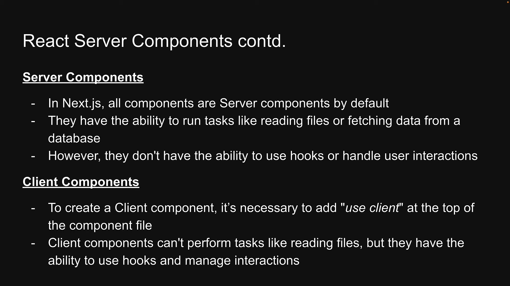
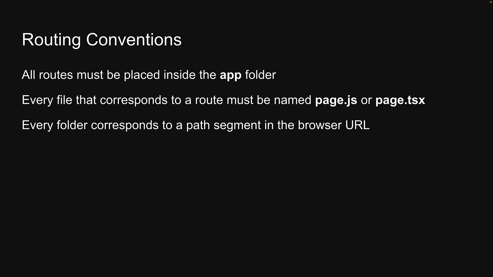
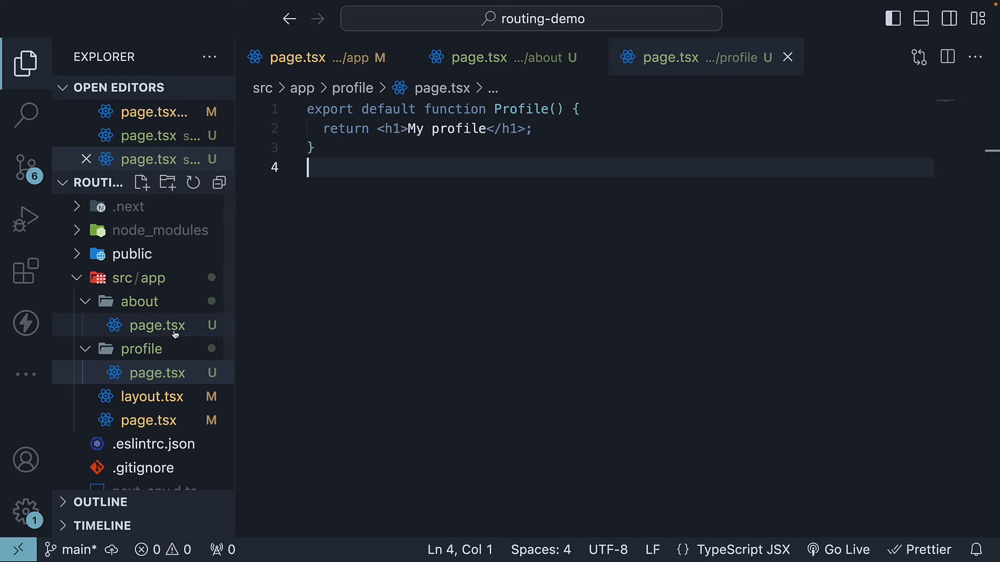
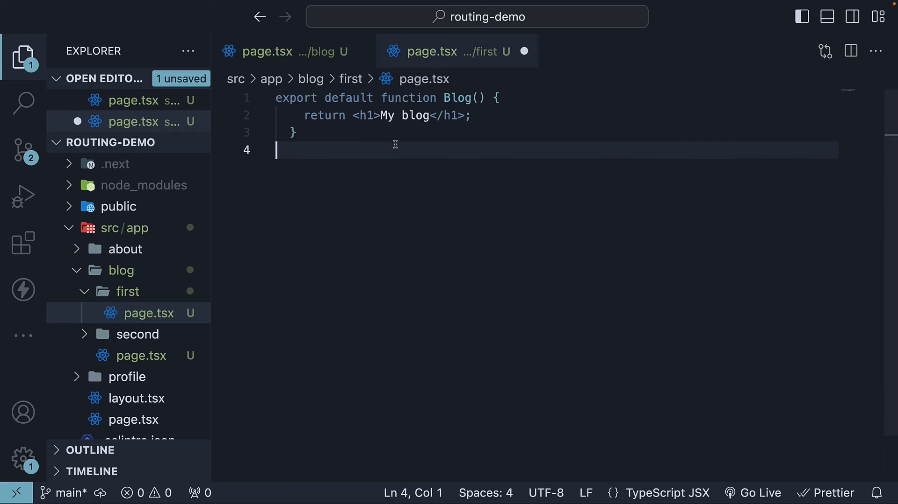
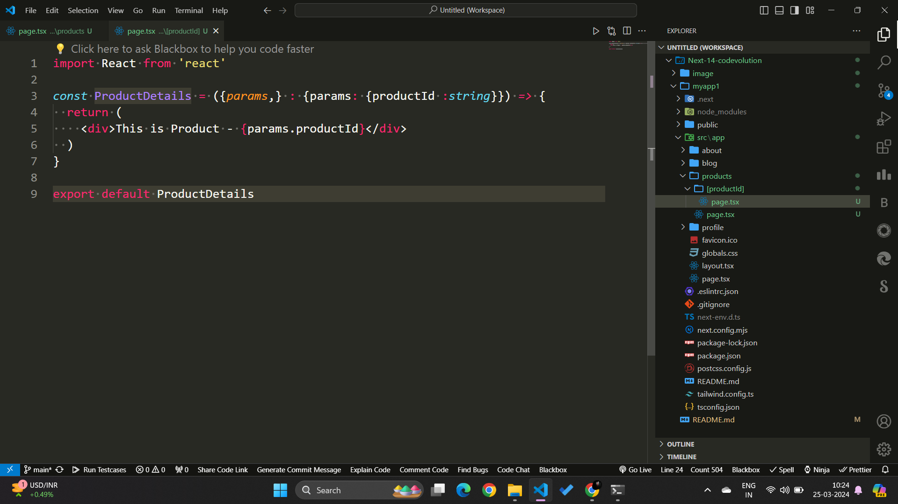
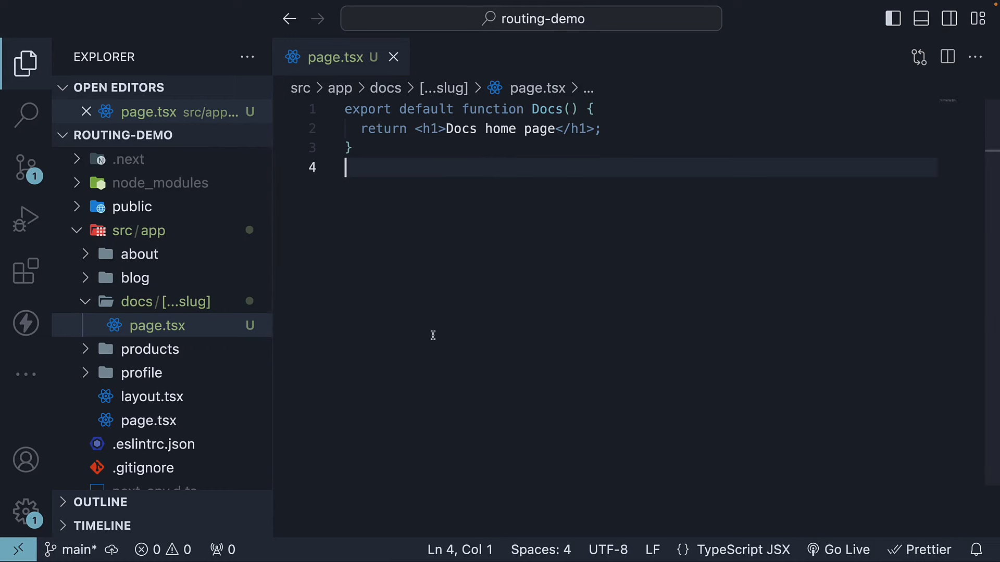
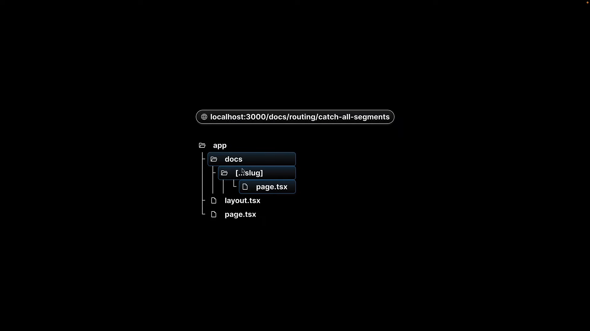
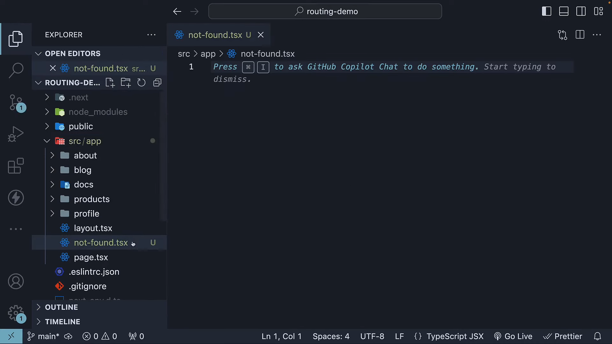

# Next-14-codevolution

### * **React Components**

---

### *  **Routing**

* even if you delete app folder , and add page.tsx is added , as soon as you run the pp , layout will be created again automatically

  
* ### **Nested routing**

### * Dynamic Routing

 

### * **Catch All segment**

 

 

### * **404 PAGE**

